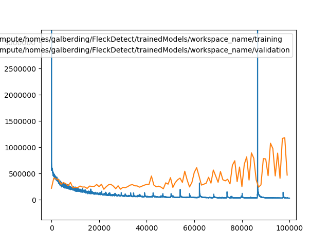
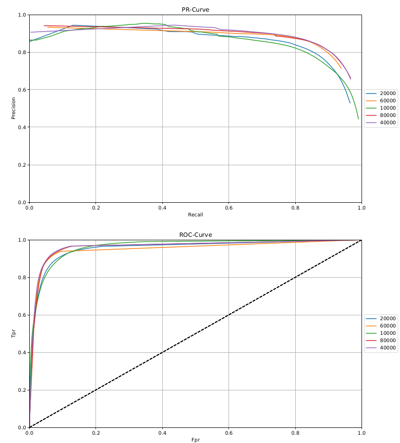

# FleckDetect

This repository was created within the scope of an ISY project. In the course of the project, the above mentioned RAS architecture was to be investigated with regard to segmentation capabilities on the SOC and MSRA-B data set. Both datasets can be downloaded [here](http://mmcheng.net/SOCBenchmark/). 

Furthermore, the resulting model should be evaluated and fine-tuned on a different dataset, containing images of laundry with dirty spots (this dataset will **not** be published).
 
The program  in this repository manages the execution of the training (we used [caffee](http://caffe.berkeleyvision.org/) for this), the segmentation and calculation of metrics. 
In order to manage multiple training rounds with different data sets workspaces are used to evaluate one model at different iteration stages. The best model can then be trained on a different data set.   

## Tabel of Contents

- [FleckDetect](#fleckdetect)
  * [Tabel of Contents](#tabel-of-contents)
  * [Getting started](#getting-started)
    + [Setup GPU Environment](#setup-gpu-environment)
    + [Setup CPU Environment](#setup-cpu-environment)
  * [Usage](#usage)
    + [Create a Workspace](#create-a-workspace)
    + [Register a Data Set](#register-a-data-set)
    + [Prepare the Training](#prepare-the-training)
    + [Start the Training](#start-the-training)
    + [Evaluate a Model](#evaluate-a-model)
    + [Select a Model](#select-a-model)
    + [Segment a Dataset](#segment-a-dataset)
    + [Calculate Metrics:](#calculate-metrics)
    + [Generate Plots](#generate-plots)
  * [Additional Features](#additional-features)
    + [Working with Custom Models](#working-with-custom-models)
    + [Fine-tune a Model](#fine-tune-a-model)
    + [Generate Linkfiles](#generate-linkfiles)
  * [Results](#results)
    + [RAS trained on MSRA-B](#ras-trained-on-msra-b)
    + [RAS trained on SOC](#ras-trained-on-soc)
    + [RAS trained on Combination of MSRA-B and SOC](#ras-trained-on-combination-of-msra-b-and-soc)
  * [Findings](#findings)

## Getting started
Unfortunately it is only possible to use the [trainer script](#start-the-training) and the [segmentation](#segment-a-dataset) with prebuild cuda and caffe version.
If you have access to the CITEC GPU cluster you can use a variant of the presented script below.


### Setup GPU Environment
* Setup your python interpreter (Version 2.7) and install the requirements:
```
pip intall -r requirements2.7.txt
```
* Create a script ```env.sh``` for loading cuda and caffe 
```bash
# load cuda
module add cuda/8.0

#load caffe layer
export PATH=$PATH:/path/to/compute/home/dist_cuda8.0_cudnn5.1/bin
export PYTHONPATH=$PYTHONPATH:/path/to/compute/home/dist_cuda8.0_cudnn5.1/python
export LD_LIBRARY_PATH=$LD_LIBRARY_PATH:/path/to/compute/home/dist_cuda8.0_cudnn5.1/lib
export PYTHONPATH=$PYTHONPATH:/path/to/compute/home/FleckDetect/scripts/model/AugLayer/

# optional: load your virtual environment 
source path/to/python/env/bin/activate
```
* Allocate a job
```
salloc -c 2 --gres=gpu:gtx:1 --partition=gpu --time=48:00:00 --mail-type=BEGIN --mail-type=END --mail-user=user@techfak.uni-bielefeld.de bash
```
* Now load your environment 
```
source env.sh
```

Now you are able to use the trainer script and the segmentation. Keep in mind that you need to use the ```srun``` command to trigger the segmentation:
```
srun python controller.py --seg msrab
```
### Setup CPU Environment
* Setup a virtual environment for python (Version >= 3.6, tested with 3.7) and install the requirements
```
pip install -r requirements3.6.txt
```

## Usage
First of all there are a few key components from which the whole projects will be controlled. The main entrypoint can be found in ```scrips/``` under the name ```controller.py```. All major changes, adaptations and preparations of datasets, models or the training itself will happen here with the help of the controller. You can list all possible options by executing:
```


> python controller.py -h
usage: controller.py [-h] [-w WORKSPACE] [-l] [--prep-train PREP_TRAIN]
                     [--create-link-file CREATE_LINK_FILE [CREATE_LINK_FILE ...]]
                     [-e] [--sel SEL] [--seg SEG] [--seg-all]
                     [--cal-metrics CAL_METRICS] [--cal-all-metrics] [-t]
                     [--retrain RETRAIN] [--plot-models] [-p PLOT]
                     [--col-plots] [--gen-all-plots] [--gen-pr-roc-plot]
[...]
```
This will also give you some short introduction of the options, but we will go through them together.

### Create a Workspace
Creation of a workspace is fairly easy: 
```
> python controller.py -w workspace_name
Workspace currently set to: workspace_name
Create Workspace
Active model not set!
No model specified, searching for local model ...
Selecting a model after training with --sel <iteration> or copy it in the workspace.
```
As you can see the controller is complaining about some things which will be resolved in the next sections.
What happened?
* A workspace with ```workspace_name``` in the directory ```trainedModels``` was created
* No active model was set means, that you need to explicitly select a trained model (```--sel```)
* You are able to select a model when the workspace is properly set up (```--prep-train```)

### Register a Data Set
The controller uses two kinds of configuration files ```datasets.yml``` which contains all paths to the data sets, and ```workspace.yml``` that holds paths and names for directories and files which will be created in the different workspaces.

In order to register a new dataset it needs to be properly placed in the ```Datasets``` directory (otherwise it messes up the linkfile generation which will be explained later.)
Use the following command to copy a dataset in the project:
```
cd path/to/FleckDetect
mkdir -p Datasets && cd Datasets 
cp -r path/to/dataset .
```
Adapt the ```datasets.yml``` config to register your dataset like int the following example:
```yaml
dataset:
  msrab:
    train:
      gt: Datasets/MSRA-B/train/gt
      img: Datasets/MSRA-B/train/Img
      out: msrab_train
    val:
      gt: Datasets/MSRA-B/val/gt
      img: Datasets/MSRA-B/val/Img
      out: msrab_val
  soc:
    train:
      gt: Datasets/SOC6K_Release/TrainSet/gt
      img: Datasets/SOC6K_Release/TrainSet/Imgs
      out: soc_train
    val:
      gt: Datasets/SOC6K_Release/ValSet/gt
      img: Datasets/SOC6K_Release/ValSet/Imgs
      out: soc_val
```
Here we registered two datasets: ```msrab``` and ```soc```. 
Those names can be used by some commands to address a specific dataset.
Each dataset needs to be composed of a **train** and **validation** set with a directory pointing to the images (_img_) and another directory for the ground truth samples (_gt_). Furthermore each subset needs to contain an output name (_out_). This will be the name for directory of the segmented samples later on.
It is necessary to specify a _train_ and _val_ set for each dataset with the three described attributes above.

### Prepare the Training
Once you have [created a workspace](#Create-a-Workspace) and [registered a dataset](#Register-a-Data-Set) you can precede with the training preparation. 

Linkfiles (as I call them) are textfiles which contain paths to all samples in the train/val dataset and their corresponding ground truth.
These files are essential for caffe to know where the dataset is located and which samples should be used. The generation is implicitly executed with the training preparation.
See extract below:
```
Datasets/MSRA-B/train/Img/0_18_18562.jpg Datasets/MSRA-B/train/gt/0_18_18562.png
Datasets/MSRA-B/train/Img/10_96835757_c609dbaa80.jpg Datasets/MSRA-B/train/gt/10_96835757_c609dbaa80.png
Datasets/MSRA-B/train/Img/7_190_190902.jpg Datasets/MSRA-B/train/gt/7_190_190902.png
Datasets/MSRA-B/train/Img/9_15319.jpg Datasets/MSRA-B/train/gt/9_15319.png
[...]
```


You can prepare the training with:
```
python controller.py --prep-train msrab
```
This will:
* create a solver file in ```/scripts/model``` 
* create a training script ```/scripts/model/train.sh```
* specify the name (msrab) of the models which will be stored every 1000 iterations 
* specify a name (msrab) for the logfile (used for evaluation)
* create linkfiles: That is, files that contain the path to _img_ and _gt_ samples
* copy linkfiles to ```imagemaps/train.txt``` and ```imagemaps/val.txt```

When the preparation was successful you see something like this:
```
Workspace currently set to: workspace_name
Active model not set!
No model specified, searching for local model ...
Selecting a model after training with --sel <iteration> or copy it in the workspace.
Try to link files from msrab_train
Create pairs
100%|██████████████████████████████████████████████| 4913/4913 [00:04<00:00, 1119.95it/s]
Write pairs to file:
100%|██████████████████████████████████████████████| 4913/4913 [00:00<00:00, 426735.19it/s]
done!
Try to link files from msrab_val
Create pairs
100%|██████████████████████████████████████████████| 87/87 [00:00<00:00, 30222.33it/s]
Write pairs to file:
100%|██████████████████████████████████████████████| 87/87 [00:00<00:00, 207686.08it/s]
done!
```

### Start the Training
In order to start the training you need to [prepare it](#Prepare-the-Training).

Usually there should be weights provided for the network. If you want to use your own weights 
adapt the workspace.yml:
```yaml
path:
  base_weights: scripts/model/weights.caffemodel
  [...]
```
If you have access to the techfac network you can use the provided script: ```scripts/model/getWeights.sh``` to copy weights into the project.
```
cd scripts/model
./getWeights.sh
```
__**WARNING:**__: If you change the path to the weights [prepare the training](#Prepare-the-Training) again to make sure all paths are set correctly!

Subsequent, witch into the ```model``` directory and execute the trainer script:
```
cd scripts/model
./train.sh
```
Now the training should start and log all output in ```scripts/model/logs/msrab```.
The models will be stored under ```scripts/model/snapshot/ras_msrab_iter_<iteration>.caffemodel``` 

__**WARNING:**__ The trainer expects to run on a [slurm workload manager](https://slurm.schedmd.com/overview.html). You probably need to adapt the trainer script according to your system.


### Evaluate a Model
Once you are done with a [training](#Start-the-Training) there will be lots of different versions of one model listed in ```scripts/model/snapshot/```.
Without further investigation it is hard to tell which one to choose. To ease the 
decision of choosing one model you can **plot** the _train_ an _validation_ scores.
```
> python controller.py -e 
Workspace currently set to: workspace_name
Active model not set!
/media/compute/homes/galberding/FleckDetect/scripts/model/logs/msrab.out
/media/compute/homes/galberding/FleckDetect/trainedModels/workspace_name/training : lowest loss 26906.0 at iteration 99760.0
/media/compute/homes/galberding/FleckDetect/trainedModels/workspace_name/validation : lowest loss 198389.0 at iteration 22000.0
No active model specified. This should be resolved after selecting a model after training with --sel <iteration>
```
The output gives information about the lowest validation and test score. 
This can also be observed in the generated plot below:



### Select a Model
Based on the [evaluation](#Evaluate-a-Model) you can select a model at a specific iteration.
```
> python controller.py --sel 10000
Workspace currently set to: workspace_name
Active model not set!
New active model set to: 10000
```
* The model ```ras_msrab_iter_10000.caffemodel``` is copied to the workspace
* the active model is set to iteration 10000
* All further evaluation techniques will use this model

### Segment a Dataset
If a [model is selected](#Select-a-Model) you can use this model to segment a **validation** dataset, specified in your ```gpu.yml```
```
python controller.py --seg msrab
```
This creates a directory in the workspace where all the predictions/segmentations are stored.

If you want to segment the **training** set use 
```
python controller.py --seg msrab -t
```

If you have more than one dataset you want to segment you can segment all with the option:
```
python controller.py --seg-all [-t]
```

### Calculate Metrics:

Before calculating metrics of your [segmented](#Segment-a-Dataset) dataset you need to build the executable:
```
cd /scripts/eval/cpp
mkdir build && cd build 
cmake ..
make
```
Subsequent, calculate the metrics for a specific dataset:
```
python controller.py --cal-metrics msrab [-t]
```
This will use the predictions in your workspace and the ground truth of the dataset to generate the following metrics: 
**Mean Absolute Error, Precision, Recall, Fbeta-Score, False Positive Rate** and **True Positive Rate**.

As described in the previous section, the metrics for each dataset can be calculated as follows:
```
python controller.py --cal-all-metrics [-t]
```

### Generate Plots 
The metrics of one workspace can be visualized in form of a Receiver-Operating-Characteristic and Precision-Recall-Curve.
```
python controller.py --plot-models
```
This will store the results of each model for one dataset in the workspace in the ```plot``` directory.

An example is shown below:



After generating all the plots you want, it is possible to collect all the plots in 
the ```assets/plots``` directory. 
```
python controller.py --col-plots
```

## Additional Features
### Working with Custom Models
If you have a pretrained caffemodel which you want to use for segmentation/evaluation, create a workspace and copy it inside:
```
> python controller.py -w test
Workspace currently set to: test
Active model not set!
No model specified, searching for local model ...
No local model found!
This should be resolved after selecting a model after training with --sel <iteration>
```
Copy your model inside and within the next execution of the controller it should automatically be detected:
```
> cp sgd1.caffemodel trainedModels/test/
> python controller.py 
Workspace currently set to: test
Active model not set!
No model specified, searching for local model ...
Found: sgd1.caffemodel
New active model set to: sgd1
```

### Fine-tune a Model 
After you have evaluated a model you may want to use it for further purposes like fine-tuning 
on a different dataset. You can do this by switching in the respective workspace, select the model you want 
(the **active model is selected automatically**), and specify the dataset on which you want to tune the model:
```
> python controller.py -w test 
Workspace currently set to: test
Active model:  sgd1
Workspace currently set to: test_on_soc
Create Workspace
Active model not set!
Try to link files from soc_train
Create pairs
100%|████████████████████████████████| 294/294 [00:00<00:00, 16727.15it/s]
Write pairs to file:
100%|████████████████████████████████| 294/294 [00:00<00:00, 350319.71it/s]
done!
Try to link files from soc_val
Create pairs
100%|████████████████████████████████| 54/54 [00:00<00:00, 54960.55it/s]
Write pairs to file:
100%|████████████████████████████████| 54/54 [00:00<00:00, 221833.90it/s]
done!
```
* A new workspace is created with naming: test_on_soc
* Linkfiles for the soc dataset are created 
* Link to active model in _test_ is set in the ```scripts/model/config.yml```

### Generate Linkfiles 

There are two ways to generate a linkfile, but they both assume that the dataset you use 
for generation is located in the ```Datasets``` directory.

First of all is it possible to generate those files for the train or validation set 
of one dataset. 
```
python controller.py --create-link-file msrab [-t]
```
If you set the ```-t``` flag the linkfile for the trainset is generated and stored in the 
current workspace.

Second, by pointing to the specific directories:
```
python controller.py --create-link-file <name> ../Datasets/DatasetName/images ../Datasets/DatasetName/groundTruth
```
The ```--create-link-file``` option expects a name for the linkfile which is stored in 
the workspace, and a path to the images and ground truth.

## Results
Three datasets served as the basis for all experiments: MSRA-B, SOC, and FleckSet (not published). 
The RAS network was trained on the two data sets MSRA-B, SOC, and a combination of the two. 
Adam was used as the optimizer with a learning rate of 0.001. 
Each net was trained 100000 iterations.
The three trained nets were then used for finetuning on the FleckSet. 
During finetuning all parameters except the learning rate (0.0001) remained the same.
The following illustrations show the performance of each network at different training stages.

### RAS trained on MSRA-B
RAS-Net trained on MSRA-B, evaluated on the validation set:


Results after finetuning on the FleckSet's validation set:


### RAS trained on SOC
RAS-Net trained on SOC, evaluated on the validation set:


Results after finetuning on the FleckSet's validation set:


### RAS trained on Combination of MSRA-B and SOC
RAS-Net evaluated on the validation set:


Results after finetuning on the FleckSet's validation set:


## Findings

First of all, it can be said that the model that was trained on the MSRA-B data set 
ultimately performs best on the FleckSet. 
In general, it was observed that shorter training time leads to higher recall 
but lower precision and vice versa. 

Furthermore, it was observed that the SOC and MSRA-B models operate differently. 
SOC has a lower recall. This can be explained by the structure of the data set. 
This consists to a large extent of images with only background. 
The net is therefore trained not to segment anything on these images 
or to segment up to two objects on other images.
This makes the network tend to segment less on an image rather than too much.

With the MSRA-B model, the opposite is true.
Here there is an object in the middle of each image. So the network tends to segment 
more which explains the higher recall. 

The Results of the combined model are quite disappointing on the validation set.
This could be because this set is extremely unbalanced, as only about 10% of the validation set 
consists of MSRA-B images. 
The results on the FleckSet seem to confirm that the results are misleading. 
Here the combined model gives much better values (higher precision) than the SOC model. 
Furthermore, the combined model seems to achieve similarly good results as the MSRA-B model, 
at least as far as the ratio of Precision and Recall is concerned. 

Finally, it can be said that the RAS net is a suitable architecture to be used on the FleckSet. 
It would make sense to use a combination of the MSRA-B and SOC data sets for the training in order 
to obtain a model that is as robust as possible.
